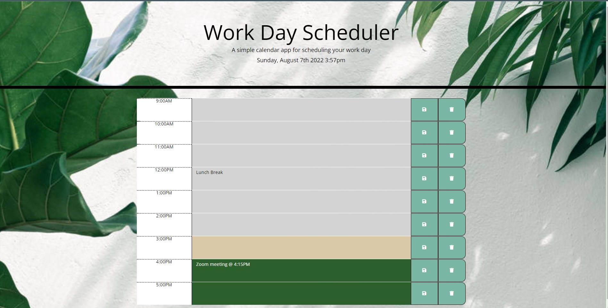

# Work Day Scheduler - Challenge Module 5

Description

The purpose of this week's challenge is to create an interactive daily planner for an employee who wants to manage their time effectively. This application was built using HTML, CSS, and Javascript. The Moment.js library is used to automatically view the current date and time of day. Jquery is a Javascript library that helped simplify code, making Javascript easier to work with. Bootstrap is a CSS framework that helped in arranging each of the components making up each of the rows of timeblocks into a grid system. 

Webpage Preview

Here is the link of the deployed webpage: https://tonytran97.github.io/ChallengeModule05/